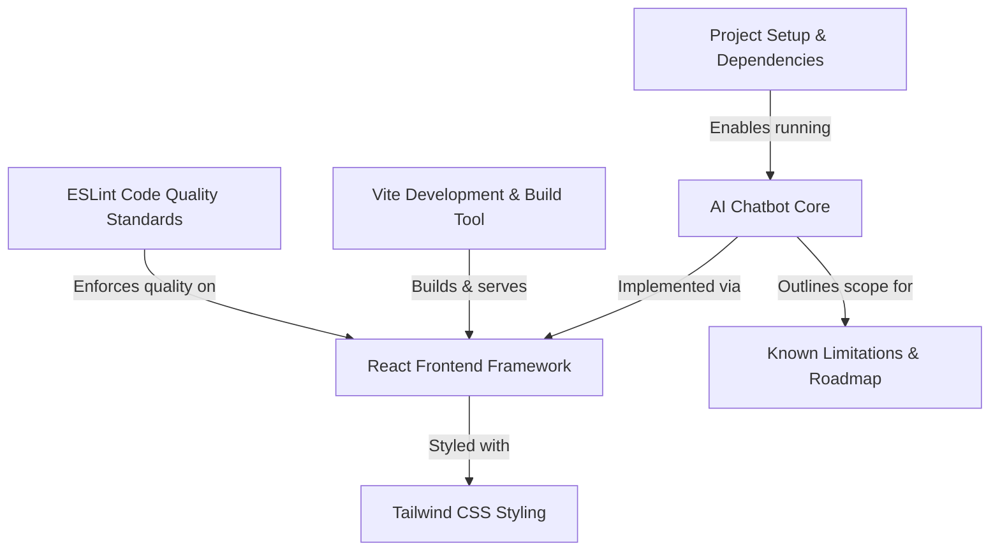
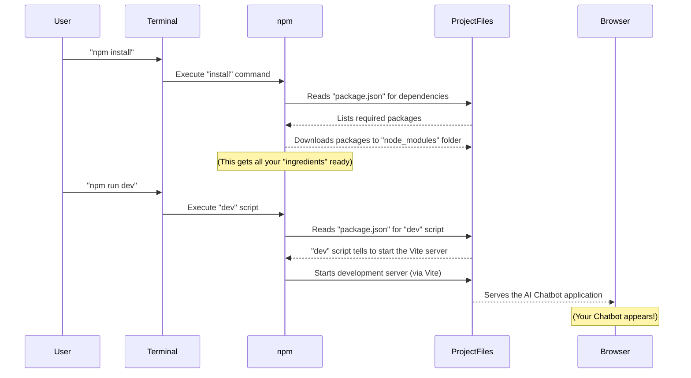
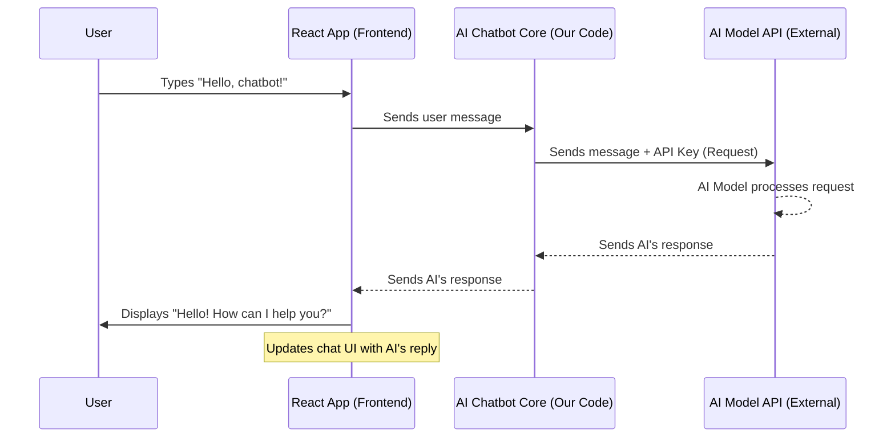
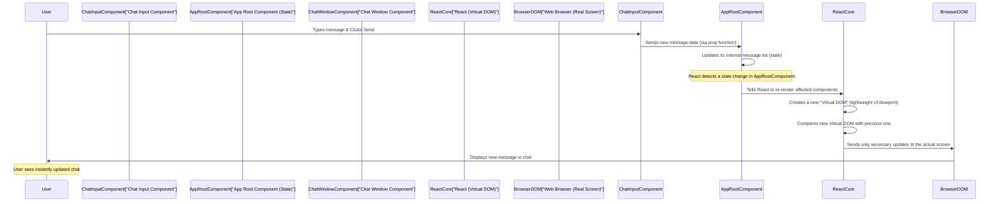
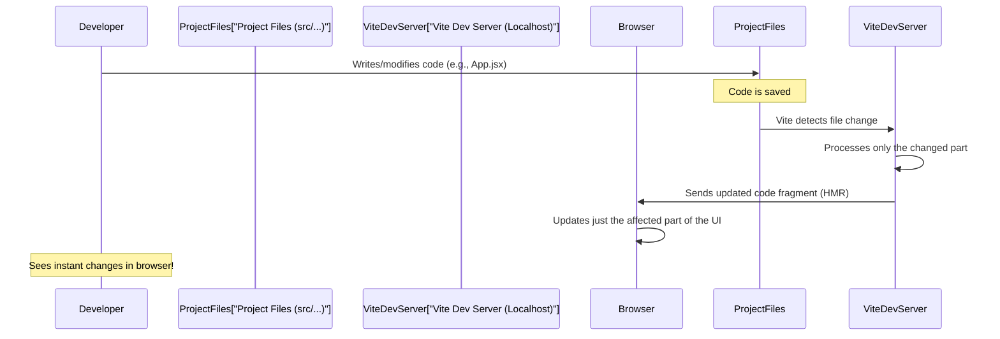
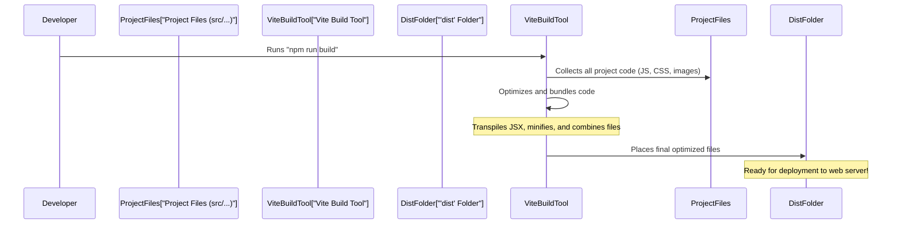
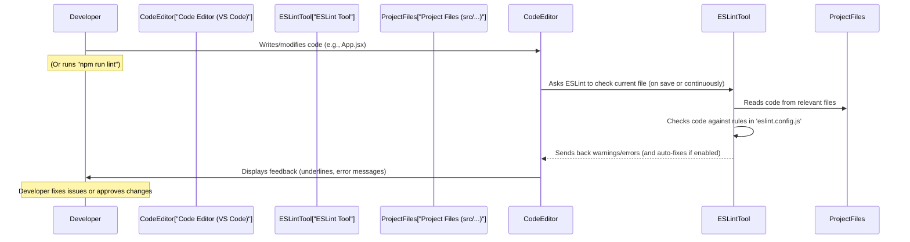
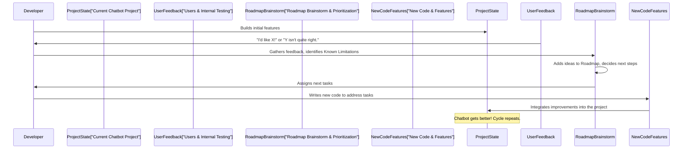

# AI Chatbot (Gemini-like)

This project is an **AI Chatbot** that allows users to *interact* with an artificial intelligence, similar to how popular services like Gemini work. Its main purpose is to let you *ask questions* and receive intelligent, relevant answers, providing a simple, interactive conversational experience.

## Demo

**Landing page:**


**Chatting Page:**


## Visual Overview



## Chapters

1. Project Setup & Dependencies
2. AI Chatbot Core
3. React Frontend Framework
4. Vite Development & Build Tool
5. Tailwind CSS Styling
6. ESLint Code Quality Standards
7. Known Limitations & Roadmap

---

# Chapter 1: Project Setup & Dependencies

Welcome to the exciting world of building an AI Chatbot with React! Before we dive into the fascinating parts of how the chatbot thinks or how it looks, we first need to get all our tools and ingredients ready. Think of it like preparing to cook a delicious meal: you can't start cooking until you have all your ingredients gathered and your stove turned on!

In this chapter, we'll learn the two essential first steps to get our AI Chatbot up and running on your computer.

### The Problem: How do we start the Chatbot?

Imagine you've just received a brand new recipe book for your favorite dish. You have the instructions, but you don't have any of the actual food items yet, nor is your kitchen prepped. Our AI Chatbot project is similar. You have the project's code files, but to make it *work* and show up in your web browser, we need to do two main things:

1.  **Gather all necessary "ingredients"**: Our chatbot project relies on many smaller software pieces (like special tools or pre-made mixes) created by other people. These are called "dependencies." We need to download and set them up.
2.  **Start the "cooking process"**: Once all ingredients are ready, we need to tell the project to start running, like turning on the stove and beginning to cook the meal.

Let's see how we do this with simple commands.

### Key Concepts: `npm install` and `npm run dev`

To solve our problem, we'll use two powerful commands: `npm install` and `npm run dev`. Both use a tool called `npm` (Node Package Manager), which helps us manage our project's "ingredients" and "cooking instructions."

#### 1. `npm install`: Gathering Your Ingredients

When you work on a software project like our AI Chatbot, it's rare to build *everything* from scratch. Instead, developers use existing "packages" or "libraries" that provide useful functions. For example, our project uses React (a framework for building user interfaces) and Tailwind CSS (a tool for styling). These are our "ingredients" or "dependencies."

The `npm install` command tells `npm` to look at a special file in our project called `package.json`. This file lists all the dependencies our project needs. `npm` then automatically downloads all these necessary pieces of software from the internet and puts them into a special folder named `node_modules` inside our project.

#### 2. `npm run dev`: Starting the Cooking Process

Once all the ingredients are gathered in `node_modules`, we're ready to "cook"! The `npm run dev` command tells `npm` to run a specific "script" that has been set up in our project. In our case, this script is designed to start a "development server."

A development server is like a mini-web server running on your computer. It serves your chatbot application, allowing you to see it in your web browser. This server also watches for any changes you make to the code, automatically updating the browser so you can see your changes instantly. This setup is powered by a tool called Vite Development & Build Tool, which we'll explore in a later chapter.

### How to Get the Chatbot Running

Now, let's put these concepts into practice. Follow these steps to get your AI Chatbot ready and running on your local machine:

**Step 1: Open your Terminal or Command Prompt**

First, you need to open a "terminal" (on macOS/Linux) or "command prompt" (on Windows). This is a text-based window where you can type commands for your computer to execute.

**Step 2: Navigate to your project folder**

Use the `cd` (change directory) command to go into the folder where you saved the `AI-chatbot-using-react` project. For example, if you saved it in a folder called `my-projects` on your desktop:

```bash
# Example command (your path might be different)
cd Desktop/my-projects/AI-chatbot-using-react
```

After you type `cd` and the path, press `Enter`. You should now see the name of your project folder at the beginning of the line in your terminal.

**Step 3: Install the dependencies**

Now, type the following command and press `Enter`:

```bash
npm install
```

**What happens next?**

You'll see a lot of text scrolling by in your terminal. This means `npm` is downloading and setting up all the necessary packages. It might take a few minutes depending on your internet speed. When it's done, you'll see your command prompt return, meaning it's ready for your next command. If you look inside your project folder, you'll now see a new folder called `node_modules` – that's where all the ingredients are stored!

**Step 4: Start the development server**

Once `npm install` is finished, it's time to start the chatbot! Type this command and press `Enter`:

```bash
npm run dev
```

**What happens next?**

Again, you'll see some text in your terminal. This time, it will tell you that the development server has started. It will also usually provide a web address (like `http://localhost:5173/` or similar).

Your web browser should automatically open a new tab and display the AI Chatbot's landing page! If it doesn't open automatically, just copy the provided web address from your terminal and paste it into your browser's address bar.

Congratulations! You've successfully set up and launched your AI Chatbot!

### Under the Hood: How it All Connects

Let's take a quick look at what's happening behind the scenes when you run these commands. It's like a small dance between you, your terminal, `npm`, and the project files.



In short:

*   When you type `npm install`, `npm` reads the `package.json` file to know *what* external libraries are needed. It then downloads all those libraries into a special folder called `node_modules` within your project.
*   When you type `npm run dev`, `npm` looks at the `scripts` section of `package.json`. It finds the `dev` script and runs the command specified there (which uses Vite Development & Build Tool to build and serve your application).

Here's a tiny peek at what the `package.json` file might look like for our project (just the relevant parts):

```json
// File: package.json (simplified)
{
  "name": "ai-chatbot-using-react",
  "version": "1.0.0",
  "scripts": {
    "dev": "vite", // This tells npm to run the 'vite' command for development
    "build": "vite build",
    "lint": "eslint . --ext js,jsx --report-unused-disable-directives --max-warnings 0",
    "preview": "vite preview"
  },
  "dependencies": {
    "react": "^18.2.0", // React is one of our key ingredients
    "react-dom": "^18.2.0",
    // ... many more ingredients listed here
  },
  "devDependencies": {
    "vite": "^5.0.8", // Vite is also an ingredient, but for development only
    "eslint": "^8.56.0",
    // ... other development ingredients
  }
}
```
In this simplified `package.json`, notice the `scripts` section. The `dev` line tells `npm` exactly what to do when you run `npm run dev`. It's like the recipe telling you to "bake at 350 degrees." The `dependencies` section lists all the main ingredients our chatbot needs to function, like "React."

### Conclusion

You've just completed the crucial first step in bringing our AI Chatbot to life! You learned how to gather all the necessary project "ingredients" using `npm install` and how to "start cooking" by running the development server with `npm run dev`. This process is fundamental for any modern web project.

Now that our project is set up and running, we can start exploring the core of our AI Chatbot. In the next chapter, we'll begin to understand what makes our chatbot "smart" and how it processes your questions and generates responses.

---

# Chapter 2: AI Chatbot Core

Welcome back! In Chapter 1: Project Setup & Dependencies, we got our AI Chatbot project up and running on your computer. You saw the basic layout of the chatbot in your web browser. But how does it actually *think*? How does it understand your questions and generate clever answers?

That's exactly what we'll explore in this chapter: the **AI Chatbot Core**. Think of this as the "brain" of our digital assistant.

### The Problem: How Does the Chatbot "Think"?

Imagine you're talking to a very smart friend. You ask them a question, and they give you a thoughtful answer. Our chatbot needs to do the same thing!

The challenge is:
1.  **Understanding**: How does a computer program understand the meaning of your typed words?
2.  **Generating**: How does it come up with a relevant and coherent answer?

Our project's main purpose is to solve this by providing an AI-powered conversational experience. Users type questions or prompts, and the chatbot uses Artificial Intelligence (AI) to produce answers.

### Key Concept: The AI Model - The Chatbot's Brain

At the heart of any "smart" chatbot is something called an **AI Model**.

What is an AI Model?
*   **A Super-Smart Predictor**: Imagine a vast library of all the text ever written on the internet. An AI model is like a super-intelligent student who has read *all* of it. When you give it a new sentence or question, it uses everything it has learned to predict the most likely and relevant next words to form an answer.
*   **Not Magic, But Math**: It's not truly "thinking" like a human. Instead, it's using incredibly complex mathematical patterns learned from massive amounts of data.
*   **We Don't Build It**: Building one of these AI models from scratch is a huge task, requiring immense computing power and data. Luckily, companies like Google (with their Gemini model, which inspired this project) have already done this hard work for us! We simply *use* their pre-trained models.

So, the "AI Chatbot Core" in our project is essentially the part of our code that knows how to "talk" to one of these external, super-smart AI models.

### Key Concept: API - The Communication Bridge

How does our chatbot program "talk" to Google's Gemini AI model (or any other external AI model)? They can't just send thoughts to each other! They need a structured way to communicate. This is where an **API** comes in.

**API stands for Application Programming Interface.**

Think of an API like a menu in a restaurant:
*   You (our chatbot program) don't need to know how the kitchen (the AI model) prepares the food.
*   You just look at the menu (the API documentation) to see what you can order (what kinds of questions you can ask).
*   You place your order (send a "request" with your question).
*   The kitchen prepares it and sends it back to you (the AI model sends a "response" with the answer).

Our **AI Chatbot Core** is responsible for sending your question (the "request") through this API to the AI model and then receiving the AI's answer (the "response") back.

### How Our Chatbot Uses the AI Core

Let's look at the basic flow when you type a question into our chatbot:

1.  **You type a message:** You type "What is the capital of France?" into the chat box.
2.  **Our React App sends it:** The part of our code that manages the visual interface (built with React Frontend Framework) takes your message.
3.  **AI Core takes over:** This message is then sent to the "AI Chatbot Core" part of our code.
4.  **AI Core talks to the AI Model API:** The AI Core sends your message through the internet to the external AI model's API (like Google's Gemini).
5.  **AI Model thinks:** The external AI model processes your question and generates an answer ("Paris").
6.  **AI Core receives the answer:** The AI model sends "Paris" back to our AI Core via the API.
7.  **Our React App displays it:** Finally, the AI Core sends the answer back to the React Frontend Framework, which then displays "Paris" in the chat window for you to see!

This whole process usually happens in milliseconds!

#### A Peek at the Code (Simplified Concept)

While the actual code in our project might use a specific library to talk to the Gemini API, the core idea is to send some text and get some text back.

Here's a *highly simplified* idea of what a function in our AI Core might conceptually do:

```javascript
// This is a conceptual example, not the exact project code!
async function askAIChatbot(userQuestion) {
  // 1. This is where we would securely get our special 'key'
  //    to access the AI model's API. More on this later!
  const AI_API_KEY = "YOUR_SECRET_KEY_HERE";

  // 2. Imagine sending the user's question to the AI model through its API
  console.log("AI Core: Sending question to AI model:", userQuestion);

  // 3. The AI model processes the question and sends back an answer.
  //    (This is where the magic happens behind the scenes at the AI company!)
  const aiResponse = "I received your question: " + userQuestion + ". This is my very simple answer.";

  console.log("AI Core: Received answer from AI model:", aiResponse);

  // 4. We send the AI's answer back to the part of the app
  //    that shows it on screen.
  return aiResponse;
}

// How we might use it (in another part of our app):
// const response = await askAIChatbot("What is the weather today?");
// console.log("Chatbot says:", response);
```

This tiny `askAIChatbot` function is the conceptual heart of our "AI Chatbot Core." It takes your question, *conceptually* sends it to the AI model's API, waits for the answer, and then returns it. The actual project code will use a specific AI library (like Google's own SDK) to handle the `fetch` or `axios` details, but the principle remains the same.

### Under the Hood: The Full Conversation Flow

Let's visualize the entire process using a simple diagram:



As you can see, our "AI Chatbot Core" acts as the messenger between our app's visual interface and the powerful external AI brain.

#### Protecting Our Key Ingredient: API Keys

To use an external AI model's API, you usually need an **API Key**. This is a special string of characters (like a password) that identifies you and authorizes your requests to the AI service. It's crucial to keep this key secret!

In our project, we handle this securely by not putting the API key directly in our public code. Instead, we use a special file called `.env` (short for "environment") and load the key from there. The Vite Development & Build Tool (which will be mentioned in Chapter 4) helps us use these keys safely during development.

Here's how you might see it referenced in the code, like in `src/utils/ai.js` (a conceptual file for AI communication):

```javascript
// File: src/utils/ai.js (simplified concept)

// This line securely gets your API key from the .env file.
// VITE_GEMINI_API_KEY is an environment variable you would set up.
const API_KEY = import.meta.env.VITE_GEMINI_API_KEY;

// Example function to interact with the AI
export async function getResponseFromAI(prompt) {
  if (!API_KEY) {
    console.error("AI API Key is not set!");
    return "Error: AI service not configured.";
  }
  // In a real project, this is where you'd use a library
  // to make an actual API call to the Gemini service.
  // For now, imagine it sends 'prompt' and gets a smart answer back.
  console.log(`Sending to AI: ${prompt}`);
  // This is a placeholder for the actual AI response
  const aiReply = `AI received "${prompt}". I am a friendly chatbot.`;
  return aiReply;
}
```

This `API_KEY` is your secret pass to the AI model. The `import.meta.env.VITE_GEMINI_API_KEY` part is how Vite Development & Build Tool makes sure your key is loaded correctly from your `.env` file without exposing it in the browser's code.

### Conclusion

You've now learned about the "brain" of our AI Chatbot! The **AI Chatbot Core** is the part of our project responsible for communicating with powerful external AI models (like Gemini) via their APIs. It acts as the bridge that takes your questions to the AI and brings the AI's answers back to you.

Understanding this core concept is vital for knowing how the chatbot "thinks." In the next chapter, we'll shift our focus to the "face" of the chatbot – how we build the visual parts that users interact with, using the React Frontend Framework.

---
# Chapter 3: React Frontend Framework

Welcome back! In Chapter 1: Project Setup & Dependencies, you successfully got our AI Chatbot project running. Then, in Chapter 2: AI Chatbot Core, we peeked into the "brain" of our chatbot, understanding how it communicates with powerful AI models to generate responses.

Now, let's turn our attention to the "face" of our chatbot: everything you see and interact with on your screen. How are those chat bubbles, the input box, and the send button created? How do they show your messages and the AI's replies? This is where **React Frontend Framework** comes into play.

### The Problem: Building an Interactive User Interface

Imagine you're building a complex house out of Lego bricks. You wouldn't try to build the whole house as one giant, solid piece. Instead, you'd build smaller, individual parts like walls, windows, and doors, and then connect them.

Our chatbot's visual interface (what you see in your web browser) is similar. It's not just a static picture; it's dynamic. Users type messages, new messages appear, and the screen needs to update instantly. If we tried to manage all of this manually with traditional web technologies, it would quickly become very complicated and messy!

The challenge is:
1.  **Structure:** How do we organize all the visual pieces of our chatbot (buttons, text areas, message displays)?
2.  **Interactivity:** How do we make these pieces respond when a user types or clicks something?
3.  **Updates:** How do we efficiently update only the necessary parts of the screen when new information (like an AI response) arrives, without redrawing everything?

React JS is designed to solve these problems, serving as the **fundamental structure or "blueprint"** that dictates how the chatbot's visual parts are constructed and how they behave.

### Key Concept: What is React?

React is a widely-used JavaScript library (think of it as a collection of pre-written tools) specifically designed for **creating dynamic and responsive web interfaces**. It was developed by Facebook (now Meta) and has become incredibly popular for building modern web applications.

Here's why React is so powerful for our chatbot:

*   **Component-Based:** React encourages you to break down your user interface (UI) into small, independent, and reusable pieces called **components**.
*   **Declarative:** Instead of telling the browser *how* to update the screen step-by-step, you tell React *what* the screen should look like based on your data. React then figures out the most efficient way to make that happen.
*   **Efficient Updates:** React is very smart about updating only the parts of the screen that have changed, which makes your application feel fast and smooth.

Think of it like building with **Lego bricks**. Each Lego brick is a **component**. You can create a Lego brick for a `Button`, another for a `ChatInput`, and another for a `ChatMessage`. You then combine these individual bricks to build your entire chatbot interface. The beauty is, once you have a `ChatMessage` brick, you can reuse it for every single message in the chat, just changing its color or the text on it.

### Key Concept: Components – The Building Blocks

At the core of React are **components**. A React component is essentially a JavaScript function that returns a description of what should appear on the screen.

These descriptions use something called **JSX**.

#### What is JSX?

**JSX** (JavaScript XML) looks a lot like HTML, but you write it directly inside your JavaScript code. It's a special syntax that React uses to describe the structure of your UI.

```jsx
// This is JSX!
const myGreeting = <h1>Hello, React!</h1>;
```

React then takes this JSX and translates it into actual web elements that the browser can understand and display.

#### Our First Component: A Simple Chat Message

Let's imagine a component that displays a single chat message. It needs to show the message text.

```jsx
// src/components/ChatMessage.jsx (Conceptual)

// This is a React Component function
function ChatMessage(props) {
  // We use props to get the 'message' text
  return (
    <div className="chat-bubble">
      <p>{props.message}</p>
    </div>
  );
}

export default ChatMessage; // This makes our component available to other files
```
*   This is a JavaScript function named `ChatMessage`.
*   It takes `props` as an argument. `props` (short for properties) are how we pass information into a component, like passing instructions to a Lego brick.
*   Inside, it returns **JSX**. Here, it returns a `div` element with a `p` (paragraph) tag inside it.
*   `{props.message}` is how we embed JavaScript variables (like the `message` coming from `props`) directly into our JSX.

### Key Concept: Props – Passing Information

Components are reusable, but they often need to display different information. This is where **props** come in. Props are like arguments you pass to a function, but for React components. They allow you to customize a component when you use it.

For our `ChatMessage` component, we might want to tell it not only *what* the message is, but also *who* sent it (the user or the AI), so we can style it differently.

```jsx
// src/components/ChatMessage.jsx (A bit more detail)

function ChatMessage(props) {
  // We use the 'sender' prop to decide the styling
  const bubbleClass = props.sender === 'user' ? 'bg-blue-500 text-white' : 'bg-gray-200 text-gray-800';

  return (
    <div className={`chat-bubble p-3 rounded-lg max-w-xs ${bubbleClass}`}>
      <p>{props.message}</p>
    </div>
  );
}

export default ChatMessage;
```
Now, when we use `ChatMessage` in another part of our app, we can pass it different `message` and `sender` props:

```jsx
// In another component, like our main chat display
function ChatWindow() {
  return (
    <div>
      {/* User's message */}
      <ChatMessage message="Hello AI, how are you?" sender="user" />

      {/* AI's response */}
      <ChatMessage message="I am doing well, thank you!" sender="ai" />
    </div>
  );
}
```
Notice how we use `<ChatMessage />` like an HTML tag, and we pass `message="..."` and `sender="..."` as attributes. These become the `props` object inside the `ChatMessage` component. This allows us to reuse the same `ChatMessage` component for every message in our conversation, simply by changing the `props` it receives.

### How React Builds Our Chatbot UI

Our entire chatbot application's visual interface is a tree of React components. The main application component, often called `App.jsx`, sits at the top, and it includes other components like `ChatWindow` and `MessageInput`.

Let's look at a simplified conceptual structure of our chatbot's main `App` component:

```jsx
// src/App.jsx (Simplified structure)
import React, { useState } from 'react'; // We'll talk about useState later!
import ChatWindow from './components/ChatWindow'; // Imagine this displays all messages
import MessageInput from './components/MessageInput'; // Imagine this is where you type

function App() {
  const [messages, setMessages] = useState([]); // This will hold all our chat messages

  // Function to add a new message (conceptual)
  const addMessage = (text, sender) => {
    setMessages(prevMessages => [...prevMessages, { text, sender }]);
  };

  return (
    <div className="container mx-auto p-4">
      <h1 className="text-2xl font-bold mb-4">AI Chatbot</h1>
      <ChatWindow messages={messages} /> {/* Pass messages to the chat display */}
      <MessageInput onSendMessage={addMessage} /> {/* Pass function to send message */}
    </div>
  );
}

export default App;
```
*   The `App` component brings together `ChatWindow` (where messages are shown) and `MessageInput` (where you type).
*   It uses `useState` (a special React feature called a "Hook") to keep track of the `messages` in the chat. When `setMessages` is called, React knows to update the display.
*   The `messages` list is passed down to `ChatWindow` as a prop.
*   A function `addMessage` is passed to `MessageInput` as a prop, so that `MessageInput` can tell `App` when a new message needs to be added to the chat.

This component-based approach makes the UI much more manageable. Each component has a clear responsibility, and they communicate using props.

### Under the Hood: How React Updates the UI

When you type a message and send it, or when the AI sends a response, the chat window needs to update. Here's a simplified look at how React efficiently handles these updates:



1.  **User Interaction:** You type a message into the input field (handled by a `ChatInput` component) and click "Send".
2.  **Data Update (State):** The `ChatInput` component tells the main `App` component (often through a function passed as a prop) that a new message needs to be added. The `App` component then updates its internal list of messages (its "state").
3.  **React's Virtual DOM:** When the `App` component's state changes, React immediately knows that parts of the UI *might* need to be updated. Instead of directly touching the browser's slow "Real DOM" (Document Object Model - the actual structure of the webpage), React first creates a lightweight, in-memory copy called the **Virtual DOM**. It then generates a *new* Virtual DOM that reflects the updated messages.
4.  **Difference Calculation:** React then intelligently compares the *new* Virtual DOM with the *old* one. It calculates the absolute minimum changes needed to make the real browser display match the new Virtual DOM.
5.  **Efficient Update:** Finally, React applies only these small, necessary changes to the actual browser's DOM. This is much faster than rebuilding the entire screen every time something changes.

This process ensures that our chatbot's interface is always up-to-date and feels responsive, even as messages rapidly appear.

#### React's Place in Our Project Files

You can see React being used and configured in a few places in our project:

*   **Main Application File (`src/App.jsx`):** This is where our main React component lives, tying everything together.
*   **Component Files (`src/components/`):** You'll find separate files for individual UI pieces like `ChatMessage`, `MessageInput`, etc., keeping our code organized.
*   **Vite Configuration (`vite.config.js`):** Our build tool, Vite Development & Build Tool, needs to know how to handle React code. This is done via a plugin.

```javascript
// File: vite.config.js (relevant part)
import { defineConfig } from 'vite'
import react from '@vitejs/plugin-react' // This is the React plugin!

// https://vitejs.dev/config/
export default defineConfig({
  plugins: [react()], // We tell Vite to use the React plugin here
})
```
This configuration in `vite.config.js` is essential. The `react()` plugin tells Vite to process JSX syntax (our HTML-like code in JavaScript) and prepare our React components for the browser.

*   **ESLint Configuration (`eslint.config.js`):** To maintain good code quality and catch common React mistakes, we use ESLint.

```javascript
// File: eslint.config.js (relevant part)
import react from 'eslint-plugin-react' // ESLint plugin for React
import reactHooks from 'eslint-plugin-react-hooks' // ESLint plugin for React Hooks
// ... other imports

export default [
  {
    // ... other configuration
    plugins: {
      react, // Enables React-specific linting rules
      'react-hooks': reactHooks, // Enables rules for React Hooks
      // ...
    },
    rules: {
      // ... other rules
      ...react.configs.recommended.rules, // Recommended React rules
      ...react.configs['jsx-runtime'].rules, // Rules for new JSX transform
      ...reactHooks.configs.recommended.rules, // Recommended React Hooks rules
      // ...
    },
  },
]
```
The `eslint.config.js` file includes specific plugins (`eslint-plugin-react`, `eslint-plugin-react-hooks`) and rules that help us write consistent and bug-free React code. This is part of maintaining ESLint Code Quality Standards.

### Conclusion

You've now learned about the "face" of our AI Chatbot: the **React Frontend Framework**. React allows us to break down our complex user interface into small, reusable **components**, use **JSX** to describe their appearance, and pass information between them using **props**. This component-based approach, combined with React's efficient **Virtual DOM** updates, makes our chatbot's interface dynamic, interactive, and fast.

Now that we understand how our chatbot's visual parts are built, in the next chapter, we'll dive into the tools that help us run, develop, and build our React application efficiently: the Vite Development & Build Tool.

---
# Chapter 4: Vite Development & Build Tool

Welcome back! In Chapter 3: React Frontend Framework, we learned that our chatbot's visual parts are built using **React components** and **JSX**. You saw how React helps manage what you see on the screen. But how do all those React components, JavaScript files, and styling rules get turned into a working website that your browser can display? And how do we get those super-fast updates we experienced when running `npm run dev`?

That's where **Vite Development & Build Tool** comes in!

### The Problem: From Code to Live Website (and Fast Updates!)

Imagine you're designing a detailed blueprint for a new building. You have all the plans for the walls, windows, and doors. Now, you need to actually *build* it.

When you're developing, you want to see your changes *instantly*. If you change the color of a button, you don't want to wait minutes for your computer to process it. You want to see it right away! This is like a skilled builder making a small adjustment to a window frame and seeing the result immediately without having to rebuild the whole wall.

But when the building is finished and ready for people to live in (or for our chatbot, ready to be put online for everyone to use), you need it to be efficient, small, and fast. You wouldn't ship a half-finished building with all the raw materials lying around. You'd want a polished, optimized, and complete structure.

The challenges are:
1.  **Fast Development:** How do we see our code changes reflected instantly in the browser?
2.  **Production Ready:** How do we take all our separate code files and turn them into a super-fast, efficient package that can be put on the internet?

Vite is the "construction manager" for our project. It sets up the workspace, handles all the code "materials" (like React components), and streamlines the process of preparing the application for both testing (development) and final release (production).

### Key Concept: What is Vite?

**Vite** (pronounced "Vee-t") is a modern and extremely fast tool for building web projects. It has two main superpowers:

1.  **A Development Server:** This is what makes your `npm run dev` command so speedy. It's like a special local server on your computer that serves your app while you're working on it, and it's designed to give you instant feedback.
2.  **A Build Tool:** When your chatbot is ready to go live on the internet, Vite takes all your project's files (React code, styles, etc.) and bundles them into highly optimized files that are tiny and load super-fast in a web browser.

Let's break down how Vite handles each of these roles.

### Key Concept: Vite as a Development Server (for `npm run dev`)

You experienced Vite's magic firsthand in Chapter 1: Project Setup & Dependencies when you ran `npm run dev`. This command starts Vite's development server.

#### How `npm run dev` works with Vite:

When you run `npm run dev`, Vite does a few clever things:

*   **Serves your files:** It makes your project files available through a web address like `http://localhost:5173/` that you can open in your browser.
*   **"Hot Module Replacement" (HMR):** This is the key to its speed. Imagine you change a line of code in your React component (e.g., you change the text of a button). Vite detects this change and *only* sends the updated piece of code to your browser. Your browser then swaps out just that tiny part without refreshing the entire page! It's like changing a single lightbulb in a room without turning off all the lights. This saves a lot of time and makes development feel instant.

This is why your chat page automatically updates as soon as you save a file.

#### A Peek at the `package.json` `dev` script:

As we briefly saw in Chapter 1: Project Setup & Dependencies, the `dev` script in our `package.json` simply tells `npm` to run the `vite` command:

```json
// File: package.json (relevant part)
{
  "scripts": {
    "dev": "vite", // This command starts Vite's development server
    "build": "vite build",
    // ... other scripts
  }
}
```
When you type `npm run dev`, `npm` finds "vite" and executes it, which kicks off the super-fast development server.

### Key Concept: Vite as a Build Tool (for `npm run build`)

Once you're happy with your chatbot and it's ready to be shared with the world, you need to prepare it for "production." This means getting it ready to be hosted on a real web server so anyone can access it.

#### Why we need a "Build" step:

*   **Browser Compatibility:** Modern JavaScript features (like JSX from React) aren't understood by all browsers directly, especially older ones. Vite "transpiles" this code into older, more widely understood JavaScript.
*   **Performance:** Your project has many separate files (JavaScript, CSS, images). For the fastest loading, browsers prefer fewer, larger files. Vite "bundles" these files together.
*   **Optimization:** Vite also "minifies" your code (removes unnecessary spaces, comments, and shortens variable names) and performs other optimizations to make the files as small and efficient as possible. Smaller files mean faster loading times for your users!

Think of it like preparing a delicious meal for a large party. You wouldn't just give everyone individual ingredients and tell them to cook. You'd cook the meal, divide it into neat portions, and package it up perfectly for quick serving.

#### How `npm run build` works with Vite:

When you run `npm run build`, Vite performs these crucial steps:

1.  **Collects all files:** Gathers all your React components, CSS, images, and other assets.
2.  **Processes Code:** Converts JSX into regular JavaScript, applies necessary browser compatibility fixes.
3.  **Optimizes and Minifies:** Makes the code smaller and faster by removing extra characters and making other performance tweaks.
4.  **Bundles:** Combines many small JavaScript and CSS files into fewer, larger, optimized files.
5.  **Generates Output:** Puts all the final, optimized files into a special folder, typically named `dist` (short for "distribution"). This `dist` folder is what you upload to your web server.

#### A Peek at the `package.json` `build` script:

```json
// File: package.json (relevant part)
{
  "scripts": {
    "dev": "vite",
    "build": "vite build", // This command tells Vite to prepare for production
    // ... other scripts
  }
}
```
Running `npm run build` executes `vite build`, which starts this optimization and bundling process. After it finishes, you'll find your ready-to-deploy website inside the newly created `dist` folder in your project.

### Under the Hood: How Vite Manages Our Chatbot

Let's visualize Vite's role in both development and building.

#### During Development (`npm run dev`)


In development, Vite acts like a smart assistant that's always watching your files. The moment you save a change, it instantly delivers just that change to your browser, allowing for extremely fast development cycles.

#### For Production (`npm run build`)


For production, Vite becomes a powerful factory. It takes all your raw materials, processes them thoroughly, and packages them into a super-efficient final product ready for public use.

#### Vite's Configuration: `vite.config.js`

Vite needs to know how to handle different types of files in your project. For our React chatbot, it's crucial that Vite understands **React's JSX syntax**. This is configured in the `vite.config.js` file, which acts as Vite's instruction manual.

```javascript
// File: vite.config.js
import { defineConfig } from 'vite'
import react from '@vitejs/plugin-react' // This imports Vite's React plugin!

// https://vitejs.dev/config/
export default defineConfig({
  plugins: [react()], // We tell Vite to use the React plugin here
})
```
*   `import react from '@vitejs/plugin-react'` brings in a special "plugin" for React.
*   `plugins: [react()]` tells Vite: "Hey, when you're processing files, use this React plugin to understand and transform JSX into regular JavaScript." This is how Vite knows how to read and process your `.jsx` files (like `App.jsx` and files in `src/components/` that we discussed in Chapter 3: React Frontend Framework.

#### Vite and Environment Variables (`.env` files)

Remember in Chapter 2: AI Chatbot Core, we talked about securely loading your API key from an `.env` file? Vite plays a key role here, too!

Vite automatically supports loading environment variables from `.env` files. When you create a variable like `VITE_GEMINI_API_KEY` in your `.env` file, Vite makes it available to your code through `import.meta.env.VITE_GEMINI_API_KEY`. This is a secure way to use sensitive information without embedding it directly into your public code.

```javascript
// Example in src/utils/ai.js (revisited from Chapter 2)
// This line securely gets your API key from the .env file.
// Vite makes sure it's available here.
const API_KEY = import.meta.env.VITE_GEMINI_API_KEY;

// ... rest of your AI communication code
```
Vite intelligently replaces `import.meta.env.VITE_GEMINI_API_KEY` with the actual value during development and when building for production, ensuring your key is used correctly but not exposed in the final browser-downloaded code.

### Conclusion

You've now learned about **Vite Development & Build Tool**, the powerful engine behind our AI Chatbot project! Vite acts as our "construction manager," providing a super-fast development server with **Hot Module Replacement (HMR)** for instant feedback, and a robust build tool that optimizes and bundles our code for efficient **production deployment**.

Understanding Vite's role helps us appreciate how quickly we can develop with React and how our code is prepared for the real world. In the next chapter, we'll shift our focus to the styling of our chatbot, exploring how we make it look good using **Tailwind CSS**.

---
# Chapter 5: Tailwind CSS Styling

Welcome back! In Chapter 3: React Frontend Framework, we learned how **React components** form the structure of our chatbot's user interface, like building blocks. Then, in Chapter 4: Vite Development & Build Tool, we saw how Vite helps us quickly develop and efficiently prepare our React application.

Now, it's time to make our chatbot look good! You've seen the basic layout when you ran the project, but how do we add colors, spacing, rounded corners, and make everything visually appealing? This is where **Tailwind CSS Styling** comes in.

### The Problem: Making Our Chatbot Look Pretty

Imagine you've built a wonderful Lego house (our React components) and it stands sturdy. But right now, it's just plain plastic. You want to paint the walls, add nice windows, and make the roof look cool.

Similarly, our chatbot has its structure, but it lacks visual flair. We need a way to:
1.  **Add Styles:** Apply colors, fonts, sizes, and spacing to different parts.
2.  **Be Consistent:** Ensure all chat bubbles, buttons, and input fields have a similar, polished look.
3.  **Be Flexible:** Easily change styles without rewriting a lot of code.

Traditionally, you'd write a lot of custom CSS code in separate files. This can become messy and hard to manage as your project grows. Tailwind CSS offers a different, more streamlined approach to solve this.

### Key Concept: What is Tailwind CSS?

**Tailwind CSS** is a "utility-first" CSS framework. This means that instead of writing your own CSS rules like this:

```css
/* Traditional CSS */
.my-custom-button {
  background-color: blue;
  color: white;
  padding: 16px;
  border-radius: 8px;
}
```

...Tailwind provides a huge collection of very small, single-purpose CSS classes directly available for you to use. You just add these classes to your HTML (or JSX in our React case) elements.

Think of it like this:
*   **Traditional CSS** is like cooking a meal by describing every single step in detail: "Take a pan, heat it, add oil, add chopped onions..."
*   **Tailwind CSS** is like having a kitchen filled with pre-cut vegetables, pre-cooked sauces, and pre-mixed spices. You just grab the ones you need and combine them directly in your dish.

This "utility-first" approach allows for incredibly rapid styling and highly customizable designs without needing to write extensive custom CSS rules or invent unique class names for every single element.

### Key Concept: Utility Classes – The Building Blocks of Style

The core of Tailwind CSS is its collection of **utility classes**. Each class does one specific thing. For example:

*   `bg-blue-500`: Sets the background color to a shade of blue.
*   `text-white`: Sets the text color to white.
*   `p-4`: Adds padding (space inside an element) all around.
*   `rounded-lg`: Makes the corners rounded.
*   `flex`: Turns an element into a flex container (useful for aligning items).
*   `justify-center`: Centers items horizontally within a flex container.

You combine these classes directly in the `className` attribute of your HTML/JSX elements.

#### Example: Styling a Simple Button

Let's imagine a simple button. Without Tailwind, it would look like this (very plain):

```jsx
<button>Send Message</button>
```
To make it look good with Tailwind, we just add classes:

```jsx
<button className="bg-blue-600 text-white py-2 px-4 rounded-md hover:bg-blue-700">
  Send Message
</button>
```
**What do these classes do?**
*   `bg-blue-600`: Sets the background to a darker blue.
*   `text-white`: Makes the text white.
*   `py-2`: Adds vertical padding (top and bottom).
*   `px-4`: Adds horizontal padding (left and right).
*   `rounded-md`: Gives it slightly rounded corners.
*   `hover:bg-blue-700`: A special class that changes the background color to an even darker blue when you hover your mouse over the button.

See how we didn't write any CSS? We just "painted" our button directly in the JSX using Tailwind's ready-made classes.

### How Our Chatbot Uses Tailwind CSS

Our chatbot's visual appearance, from the overall page layout to individual chat bubbles and input fields, is built using these Tailwind CSS utility classes.

Let's revisit our `ChatMessage` component from Chapter 3: React Frontend Framework and see how Tailwind classes make it look like a real chat bubble.

```jsx
// src/components/ChatMessage.jsx (Conceptual, with Tailwind)

function ChatMessage(props) {
  // Decide the styling based on who sent the message (user or AI)
  const isUser = props.sender === 'user';
  const bubbleClasses = isUser
    ? 'bg-blue-500 text-white ml-auto' // User messages: blue, white text, push to right
    : 'bg-gray-200 text-gray-800 mr-auto'; // AI messages: gray, dark text, push to left

  return (
    // Combine base classes with sender-specific classes
    <div className={`
      max-w-xs p-3 rounded-lg my-2
      ${bubbleClasses}
    `}>
      <p>{props.message}</p>
    </div>
  );
}

export default ChatMessage;
```
In this example:
*   `max-w-xs`: Sets a maximum width for the chat bubble.
*   `p-3`: Adds padding inside the bubble.
*   `rounded-lg`: Makes the corners nicely rounded.
*   `my-2`: Adds vertical margin (space above and below) to separate messages.
*   `bg-blue-500` / `bg-gray-200`: Different background colors for user vs. AI messages.
*   `text-white` / `text-gray-800`: Different text colors.
*   `ml-auto` / `mr-auto`: These classes use CSS `margin-left: auto` and `margin-right: auto` to automatically push the bubble to the right (for user) or left (for AI) in the chat window, giving that familiar chat app look.

You can explore our project's `src/components` folder to see how these classes are used extensively to style every part of the UI.

### Under the Hood: How Tailwind Works with Our Project

Tailwind CSS isn't just a static file; it's a smart system that works together with our build tools to create the most efficient CSS for our project.

#### 1. Configuration: `tailwind.config.js` and `postcss.config.js`

To use Tailwind CSS, we need to tell it where to find our code so it can scan for all the utility classes we're using. We also use a tool called PostCSS, which helps process our CSS.

*   **`tailwind.config.js`**: This file is Tailwind's brain. It tells Tailwind where to look for your code (so it can find all the `className` attributes) and allows you to customize Tailwind's default colors, fonts, spacing, and more.

    ```javascript
    // File: tailwind.config.js (simplified)
    /** @type {import('tailwindcss').Config} */
    export default {
      // This 'content' array tells Tailwind where to scan for CSS classes
      content: [
        "./index.html", // Look in the main HTML file
        "./src/**/*.{js,ts,jsx,tsx}", // Look in all JS/TS/JSX/TSX files in 'src' folder
      ],
      theme: {
        extend: {}, // This is where you can add custom colors, fonts etc.
      },
      plugins: [],
    }
    ```
    The `content` part is super important! It ensures Tailwind knows which files to "read" to find all the `className` attributes that contain Tailwind utility classes.

*   **`postcss.config.js`**: PostCSS is a tool that transforms CSS with JavaScript plugins. Tailwind CSS is one such plugin. We also use another plugin called `autoprefixer`, which automatically adds special code to make our CSS work across different web browsers.

    ```javascript
    // File: postcss.config.js (simplified)
    export default {
      plugins: {
        tailwindcss: {}, // This tells PostCSS to use the Tailwind plugin
        autoprefixer: {}, // This adds browser-specific prefixes automatically
      },
    }
    ```

#### 2. Importing Tailwind's Base Styles: `src/index.css`

Even though we primarily use utility classes, Tailwind still needs a small "base" CSS file to inject its core styles and some useful defaults. This is typically done in your main CSS file that's imported into your application.

```css
/* File: src/index.css */
@tailwind base;     /* Injects Tailwind's base styles (e.g., resets) */
@tailwind components; /* Injects Tailwind's component classes (less common for utility-first) */
@tailwind utilities;  /* Injects all the utility classes we use like bg-blue-500 */

/* You can add your own custom CSS here if needed */
body {
  font-family: 'Arial', sans-serif;
}
```
The `@tailwind` directives are special instructions that Tailwind replaces with its actual CSS during the build process.

#### 3. Vite's Role in Processing Tailwind

Remember Vite Development & Build Tool? Vite is what runs PostCSS and Tailwind. When you save a file, Vite triggers Tailwind to scan your code, generate the necessary CSS, and then inject it into your browser (during development) or bundle it for production.

```
sequenceDiagram
    participant Developer
    participant ProjectFiles["Project Files (src/...)"]
    participant ViteDevServer["Vite Dev Server"]
    participant TailwindCSS["Tailwind CSS Process"]
    participant Browser

    Developer->>ProjectFiles: Adds/changes Tailwind classes in JSX
    Note over ProjectFiles: (e.g., adds `bg-red-500`)
    ProjectFiles->>ViteDevServer: Vite detects file change
    ViteDevServer->>TailwindCSS: Vite tells Tailwind to re-scan files
    TailwindCSS->>ProjectFiles: Scans `content` paths in `tailwind.config.js`
    TailwindCSS->>TailwindCSS: Generates *only* the CSS for used classes
    TailwindCSS->>ViteDevServer: Sends generated CSS back to Vite
    ViteDevServer->>Browser: Sends updated CSS (and JS) via HMR
    Browser->>Browser: Updates UI instantly with new styles
    Note to Developer: Sees red background on element!
```

This sequence shows how Vite seamlessly integrates with Tailwind. You change a class, Vite tells Tailwind to re-evaluate, Tailwind generates just the CSS needed, and Vite updates your browser – all in milliseconds!

#### Benefits of Tailwind CSS

| Feature               | Description                                                                 | How it Helps Our Chatbot                                                  |
| :-------------------- | :-------------------------------------------------------------------------- | :------------------------------------------------------------------------ |
| **Utility-First**     | Provides tiny, single-purpose classes directly applied to elements.         | Rapidly style any part of the UI without writing new CSS.                 |
| **No Naming Classes** | You don't need to invent meaningful (or meaningless) names for CSS classes. | Saves time and avoids the mental burden of CSS naming conventions.        |
| **Consistency**       | Based on a predefined design system (colors, spacing, fonts).               | Ensures a consistent look and feel across the entire chatbot application. |
| **Purging/Optimized** | Generates *only* the CSS classes you actually use in your project.          | Keeps the final CSS file size tiny, leading to faster loading times.     |
| **Responsive Design** | Built-in classes for different screen sizes (e.g., `md:flex`, `lg:p-8`).   | Makes our chatbot look good on phones, tablets, and desktops automatically. |

### Conclusion

You've now learned how **Tailwind CSS** is used to style our AI Chatbot! By understanding its "utility-first" approach and how to apply its classes directly in our React components, you can see how we quickly build a visually appealing and consistent user interface. You also glimpsed how `tailwind.config.js`, `postcss.config.js`, and Vite Development & Build Tool work together behind the scenes to make this styling process efficient.

Now that our chatbot has a structure (React), a brain (AI Core), and a pretty face (Tailwind CSS), it's important to ensure our code remains high quality. In the next chapter, we'll explore ESLint Code Quality Standards.

---
# Chapter 6: ESLint Code Quality Standards

Welcome back! In Chapter 3: React Frontend Framework, we structured our chatbot's visual parts, and in Chapter 5: Tailwind CSS Styling, we made it look great. Our chatbot now has a brain, a structure, and a pretty face. But what about the *quality* of the code itself?

Imagine you're building a Lego castle with friends. Everyone has their way of putting bricks together. Some might leave gaps, some might use mismatched colors where they shouldn't, or some might build wobbly parts. When you try to combine everyone's pieces, it can become a messy, unstable castle!

The same can happen with code. Developers have different habits: some prefer single quotes, some double; some add semicolons, some don't; some might accidentally use a variable before it's ready. These inconsistencies and potential errors make it harder for others to read, understand, and work on the code. More importantly, they can lead to subtle bugs that are hard to find.

### The Problem: Keeping Our Code Clean and Consistent

The challenge is:
1.  **Consistency:** How do we ensure everyone writing code for the chatbot follows the same style rules?
2.  **Error Detection:** How do we automatically catch common mistakes or problematic patterns early?
3.  **Maintainability:** How do we make sure our code is easy to understand and fix, even months or years later?

Trying to manually review every line of code for these issues would be slow and tedious. This is where **ESLint** comes to our rescue!

### Key Concept: What is ESLint? – Your Automated Code Reviewer

**ESLint** is a powerful tool that acts like an automated "code reviewer" or a "grammar checker" for your JavaScript and React code. It scans your code against a set of predefined rules and tells you if you've broken any of them.

Think of it like a strict, helpful editor for your writing:
*   It checks for **typos** (potential errors like unused variables).
*   It checks for **grammar and punctuation** (consistent style like spacing, semicolons).
*   It points out **awkward phrasing** (problematic code patterns that might lead to bugs).

ESLint doesn't just tell you what's wrong; it often suggests how to fix it, and in many cases, it can even fix the issues for you automatically!

### How Our Project Uses ESLint

Our `AI-chatbot-using-react` project is configured to use ESLint to ensure all JavaScript and React code adheres to high-quality standards. This is crucial for:
*   **Collaboration:** When multiple people work on the project, everyone writes code in a similar style.
*   **Readability:** Clean, consistent code is easier to read and understand.
*   **Bug Prevention:** ESLint catches many common programming mistakes before they become real problems.

The main way you interact with ESLint in our project is through a simple command.

#### Use Case: Checking and Fixing Code Quality

Let's say you've made some changes to a file, and you want to ensure your code meets the project's quality standards.

**Step 1: Run the Lint Command**

Open your terminal (if you closed it) and navigate to your project folder using `cd AI-chatbot-using-react`. Then, type:

```bash
npm run lint
```
**What happens next?**

ESLint will scan all your JavaScript and React files. If it finds any issues, it will print messages in your terminal. These messages usually include:
*   The file name where the issue was found.
*   The line number and column number.
*   A description of the rule that was violated.
*   Whether it's a "warning" (something you should fix) or an "error" (something you must fix).

Example (you might see something similar in your terminal):

```
/src/components/MyComponent.jsx
  1:7  warning  'unusedVariable' is defined but never used  no-unused-vars
  5:1   error  Missing semicolon                           semi

✖ 2 problems (1 error, 1 warning)
```
This output tells us there's an `unusedVariable` warning on line 1 and a `Missing semicolon` error on line 5 in `MyComponent.jsx`.

**Step 2: Automatically Fix Issues (If Possible)**

Many ESLint issues, especially style-related ones (like missing semicolons or inconsistent spacing), can be fixed automatically.

To do this, you add `-- --fix` to the `lint` command:

```bash
npm run lint -- --fix
```
**What happens next?**

ESLint will scan your files again. For any issues it *can* fix automatically, it will directly modify your code files to resolve them! You won't see specific messages for the fixes, but the code in your files will change. After running this, if you run `npm run lint` again, you should see fewer or no problems.

**Pro Tip for Real-Time Feedback:** Many code editors (like VS Code) have ESLint extensions that integrate directly. This means you see the warnings and errors underlined in your code *as you type*, even before you save the file! This is the most efficient way to use ESLint.

### Under the Hood: How ESLint Checks Your Code

Let's visualize how ESLint acts as our code quality guardian.


In this flow, ESLint constantly watches your code (especially when integrated with your editor) or performs a one-time check when you run the `npm run lint` command. It takes your code, compares it against the rules it knows, and then reports back any violations.

### Key Concept: The `eslint.config.js` File – ESLint's Rulebook

The brain of ESLint is its configuration file, typically named `eslint.config.js`. This file tells ESLint:
*   **Which files to check** (and which to ignore).
*   **Which programming language features** to expect (e.g., modern JavaScript, JSX for React).
*   **Which plugins to use** (plugins add specific sets of rules, like rules for React).
*   **Which specific rules to apply**, and whether they should be warnings or errors.

Let's look at a simplified version of our project's `eslint.config.js` to understand its key parts:

```javascript
// File: eslint.config.js (simplified relevant parts)
import js from '@eslint/js'
import react from 'eslint-plugin-react'
import reactHooks from 'eslint-plugin-react-hooks'

export default [
  { ignores: ['dist'] }, // 1. Don't check the 'dist' (built) folder
  {
    files: ['**/*.{js,jsx}'], // 2. Only check JavaScript and JSX files
    languageOptions: {
      // ... settings for JavaScript version and features
      parserOptions: {
        ecmaFeatures: { jsx: true }, // 3. Important: Tells ESLint to understand JSX
      },
    },
    plugins: {
      react, // 4. Adds rules specifically for React
      'react-hooks': reactHooks, // 5. Adds rules for React Hooks (like useState)
    },
    rules: {
      ...js.configs.recommended.rules, // 6. Apply standard JavaScript recommended rules
      ...react.configs.recommended.rules, // 7. Apply standard React recommended rules
      'react/jsx-no-target-blank': 'off', // 8. Example: Turn off a specific React rule
    },
  },
]
```

Here's a breakdown of what these parts do:

1.  **`ignores: ['dist']`**: This is a very useful setting! It tells ESLint to skip checking the `dist` folder, which contains the optimized, built version of our code (created by Vite Development & Build Tool). We only want to check our source code.
2.  **`files: ['**/*.{js,jsx}']`**: This specifies that ESLint should only look at files ending with `.js` or `.jsx` within our project.
3.  **`parserOptions: { ecmaFeatures: { jsx: true } }`**: This is crucial for our React Frontend Framework code. It tells ESLint that our JavaScript files might contain JSX syntax (the HTML-like code directly in JavaScript), so it knows how to read it correctly.
4.  **`plugins: { react, ... }`**: ESLint has a core set of rules, but plugins extend its capabilities. `eslint-plugin-react` adds many rules specific to React development, for example, making sure you use `key` props when rendering lists or checking for common React component patterns.
5.  **`'react-hooks': reactHooks`**: React has special functions called "Hooks" (like `useState` for managing data). The `eslint-plugin-react-hooks` plugin provides rules specifically to ensure you use these Hooks correctly, preventing common bugs related to their behavior.
6.  **`...js.configs.recommended.rules`**: This line imports and applies a standard set of recommended rules for general JavaScript coding practices. It's a great starting point.
7.  **`...react.configs.recommended.rules`**: Similar to the above, but this applies the recommended rules specifically for good React practices.
8.  **`'react/jsx-no-target-blank': 'off'`**: Sometimes, you might want to disable a specific rule that ESLint enforces by default. Here, for example, a rule that warns about `target="_blank"` without `rel="noreferrer"` is turned off. This shows how you can customize the rulebook.

By having this detailed `eslint.config.js` file, our project automatically enforces best practices for both JavaScript and React, making our code more robust and easier to manage.

### Benefits of Using ESLint

| Benefit               | Description                                                                 | Example in Chatbot Project                                           |
| :-------------------- | :-------------------------------------------------------------------------- | :------------------------------------------------------------------- |
| **Code Consistency**  | Ensures all code looks similar (spacing, quotes, semicolons, etc.).        | Everyone's React components will have a similar structure and style. |
| **Early Error Detection** | Catches common programming mistakes and potential bugs before they run.    | Prevents issues like using undeclared variables or incorrect Hook usage. |
| **Improved Readability** | Consistent and error-free code is much easier for others to understand.     | New developers can quickly grasp the codebase and contribute.        |
| **Better Collaboration** | Reduces debates over code style, as it's enforced automatically.           | Teams can focus on building features, not arguing about formatting.   |
| **Long-Term Maintainability** | High-quality code is easier to update, debug, and expand over time.        | Our chatbot will be easier to improve and add new features to in the future. |

### Conclusion

You've now learned about **ESLint Code Quality Standards**, our project's automated "code reviewer." ESLint helps us maintain clean, consistent, and high-quality JavaScript and React code by checking it against a powerful set of rules. This ensures better readability, prevents common errors, and makes our project easier for anyone to work on.

With our project's structure, brain, looks, development tools, and code quality standards in place, we have a robust foundation. In the final chapter, we'll discuss some known limitations of our current AI Chatbot and explore potential future improvements in the Chapter, "Known Limitations & Roadmap".

---
# Chapter 7: Known Limitations & Roadmap

Welcome back! In Chapter 6: ESLint Code Quality Standards, we ensured our chatbot's code is clean and consistent. We've built the foundation, understood its brain, designed its interface, set up development tools, and maintained code quality. Now, as we wrap up this tutorial, it's important to talk about what our chatbot *currently* can and cannot do, and where it might go in the future.

### The Problem: Where Do We Go From Here?

Every software project, especially one that's just starting or still in active development, has things it doesn't do yet, or features that aren't fully polished. Think of it like a car. It might drive perfectly well, but maybe the air conditioning isn't installed yet, or it doesn't have a GPS. This doesn't mean the car is bad; it just means there are features planned for later!

For our AI Chatbot, we've built a solid core. But you might have noticed some things missing or wished it could do more. This chapter is about being open and clear about those things. It serves as a:
*   **"To-Do List":** What features are still missing?
*   **"Future Ideas":** What exciting new capabilities could be added?
*   **"Known Bugs":** Are there any parts that aren't working perfectly right now?

By understanding the project's current state and future vision, you get a more complete picture of what it is and what it aims to become.

### Key Concept: Known Limitations – What's Not There (Yet!)

Our `AI-chatbot-using-react` project is a great starting point for an AI chatbot. But like any project under development, it has specific capabilities that are not yet implemented or might not function perfectly. These are what we call "**Known Limitations**". They are things we are aware of that need improvement or are planned for later.

Based on the current project's status, here are some of the known limitations:

*   **No "Enter" Key to Send Messages:** Currently, after typing a message, you have to click the "Send" button to send it. Pressing the "Enter" key on your keyboard doesn't send the message yet. This is a common feature in most chat applications that enhances the user experience.
*   **No Image Support in Chat:** The chat interface currently only supports text messages. You cannot send or display images within the chat bubbles, nor can the AI respond with images.
*   **No Audio Support in Chat:** Similarly, the project doesn't include functionality for sending audio messages (e.g., voice input) or for the AI to respond with audio.
*   **Minor Imperfections:** As mentioned in the project's description, some other smaller features might not work exactly as expected right away. This is normal in early development stages.

It's important to remember that these are not permanent flaws, but rather opportunities for future development! Many projects start with a "Minimum Viable Product" (MVP) – just enough features to be useful – and then add more over time.

### Key Concept: Roadmap – Planning the Future

If the Known Limitations are what's *missing now*, the "**Roadmap**" is *how we plan to add it* (or consider adding it) in the future. It's like a journey plan for our chatbot, outlining the potential features and improvements that could be implemented.

For our chatbot, the roadmap would ideally include tackling the known limitations first, as they directly improve the user experience. Imagine the convenience of just pressing "Enter" to send a message! Beyond fixing existing limitations, a roadmap can also include:

*   **New Features:** Adding completely new capabilities, such as saving chat history, allowing the AI to access external information (like current weather), or supporting different AI models.
*   **Performance Improvements:** Making the chatbot respond even faster or use less computer power, especially on older devices.
*   **User Experience (UX) Enhancements:** Making the interface even more intuitive, responsive, and visually appealing. This could involve smoother animations or more user-friendly error messages.
*   **Security Updates:** Ensuring the application remains secure as new threats or best practices emerge.

The roadmap serves as a guide for development, helping to prioritize tasks and ensure the project evolves in a structured way.

### How This Chapter "Solves" the Problem

This chapter doesn't involve writing new code or running commands. Instead, it provides you, as a learner and potential contributor, with a clear understanding of the project's current state. It "solves" the problem of ambiguity by outlining what needs work and what the future might hold. It allows us to manage expectations and envision the next steps for the AI Chatbot project. It's about thinking like a project manager, not just a coder.

### Under the Hood: The Cycle of Improvement

While there's no specific "code" for a roadmap, the process of developing a software project involves continuous cycles of identifying limitations, planning improvements, and implementing them. It's a never-ending journey of making things better.


This diagram illustrates a simplified loop: we build something, users give feedback (or we notice things ourselves), we add these ideas and necessary fixes to a "roadmap," we decide what to work on next, and then we write new code to make the chatbot better. This continuous cycle is how software projects grow and improve over time.

### Why Known Limitations & Roadmaps are Important

| Aspect                       | Description                                                                 | Impact on Our AI Chatbot Project                                     |
| :--------------------------- | :-------------------------------------------------------------------------- | :------------------------------------------------------------------- |
| **Transparency**             | Clearly communicates what the project can and cannot do right now.          | Users and potential contributors know what to expect.                |
| **Expectation Management**   | Prevents frustration by acknowledging missing features or imperfections.     | Users understand the project is evolving and not yet "perfect."      |
| **Community & Contribution** | Invites others to help by showing them clear areas for improvement.         | Encourages new developers like you to contribute features or fixes.  |
| **Future Planning**          | Provides a clear direction and goals for future development efforts.       | Guides what to work on next, avoiding random or unprioritized work. |
| **Scope Management**         | Helps define what is (and isn't) part of the current development phase.    | Keeps development focused and prevents trying to do too much at once. |


This project is a fantastic starting point for understanding modern web development with React and AI. We hope this tutorial has given you the confidence to explore, experiment, and even contribute to this chatbot or your own projects in the future! The world of web development is vast and constantly evolving, and you've taken a significant first step.

---


## Author

- [@bishaldebroy007](https://github.com/bishaldebroy007/)

